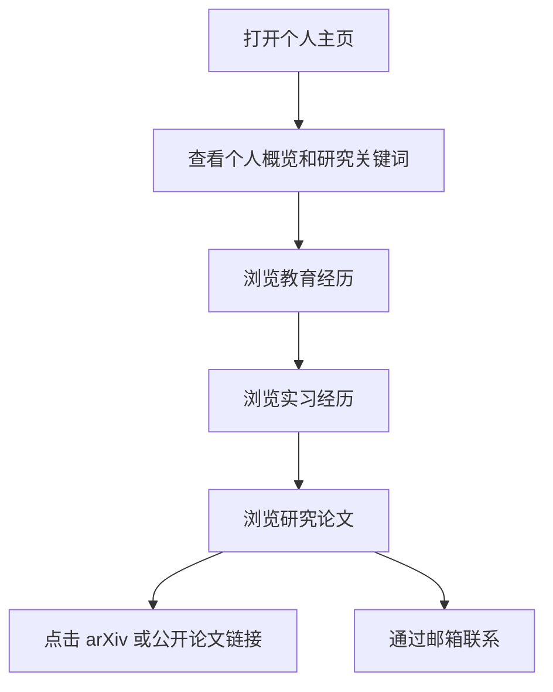

## 1. 产品概述
本项目基于 `cv.md` 生成一个个人学术主页，按简历原始顺序展示教育、实习经历、研究论文等内容，并为论文条目补充可查到的 arXiv 链接。
- 目标用户包括导师、招聘方、合作研究者和会议审稿相关访问者。
- 页面目标是快速呈现 Qingyang Liu 的研究方向、经历脉络和论文成果，形成可直接部署的静态个人主页。

## 2. 核心功能

### 2.1 功能模块
1. **首页单页**：顶部个人信息、研究关键词、教育经历、实习经历、研究论文列表。
2. **论文链接**：每篇论文展示 venue、作者贡献顺序、摘要式说明，并附公开 arXiv 链接；无法确认公开 arXiv 的条目标注“待公开/待补充”。
3. **快速导航**：桌面端固定章节导航，移动端折叠为顶部跳转。
4. **联系入口**：展示邮箱、电话，并提供 mailto 链接。

### 2.2 页面详情
| 页面名称 | 模块名称 | 功能描述 |
|---|---|---|
| 个人主页 | Hero 区 | 展示姓名、联系方式、研究方向和一句学术定位文案 |
| 个人主页 | Education | 按 `cv.md` 顺序展示北京理工大学和上海交通大学教育经历 |
| 个人主页 | Internship Experience | 按 `cv.md` 顺序展示 ByteDance Seed、Tencent WXG、ByteDance Data、Tencent TEG、Alibaba 经历 |
| 个人主页 | Research | 按 `cv.md` 顺序展示全部论文，包含 venue、作者顺序、简短贡献描述、arXiv 链接 |
| 个人主页 | Footer | 展示更新时间和联系入口 |

### 2.3 论文链接清单
| 论文标题 | 当前链接策略 |
|---|---|
| Breaking Dual Bottlenecks: Evolving Unified Multimodal Models into Self-Adaptive Interleaved Visual Reasoners | 使用 arXiv `https://arxiv.org/abs/2605.14709` |
| Bridging Visual Dynamics and Reasoning Evaluation: Multimodal Large Language Models for Short Drama Quality Assessment | 未检索到稳定 arXiv；保留公开 PDF/DOI 链接或标注待补充 |
| Why Struggle with Continuous Latent Space? Discrete Latent Reasoning via Context Render Compression | 未检索到稳定 arXiv；标注待补充 |
| Shadow Generation for Composite Image Using Diffusion Model | 使用 arXiv `https://arxiv.org/abs/2403.15234` |
| AnimateScene: Camera-controllable Animation in Any Scene | 使用 arXiv `https://arxiv.org/abs/2508.05982` |
| TiViBench: Benchmarking Think-in-Video Reasoning for Video Generation | 使用 arXiv `https://arxiv.org/abs/2511.13704` |
| UnicEdit-10M: A Dataset and Benchmark Breaking the Scale-Quality Barrier via Unified Verification for Reasoning-Enriched Edits | 使用 arXiv `https://arxiv.org/abs/2512.02790` |
| Unlocking the Black Box of Latent Reasoning: An Interpretability-Guided Approach to Intervention | 使用 arXiv `https://arxiv.org/abs/2606.01243` |
| HyperET: Efficient Training in Hyperbolic Space for Multi-modal Large Language Models | 使用 arXiv `https://arxiv.org/abs/2510.20322` |
| Shadow Generation Using Diffusion Model with Geometry Prior | 未检索到稳定 arXiv；保留 CVPR/OpenReview 链接或标注待补充 |
| Divide and Conquer: Exploring Language-centric Tree Reasoning for Video Question-Answering | 未检索到稳定 arXiv；保留 ICML/OpenReview/PDF 链接或标注待补充 |
| D3ToM: Decider-Guided Dynamic Token Merging for Accelerating Diffusion MLLMs | 使用 arXiv `https://arxiv.org/abs/2511.12280` |

## 3. 核心流程
访问者打开页面后，先看到个人概览，再通过导航按简历顺序浏览教育、实习、研究成果；在论文区点击 arXiv 或替代公开链接查看论文详情。

## 4. 用户界面设计

### 4.1 设计风格
- 主色：深墨蓝、暖象牙白；强调色使用电光青和学术金，体现 AIGC/MLLM 研究的技术感。
- 字体：标题使用有辨识度的衬线或窄体展示字体，正文使用高可读性的现代无衬线字体。
- 布局：桌面端采用左侧时间轴与右侧内容卡片交错排布，Research 区使用紧凑论文卡片。
- 动效：页面加载时分段淡入；论文卡片 hover 时显示细线描边和链接操作。
- 图形元素：使用细网格、坐标线、轻量噪点和小型 token/patch 装饰，呼应 multimodal 与 reasoning 主题。

### 4.2 页面设计概览
| 页面名称 | 模块名称 | UI 元素 |
|---|---|---|
| 个人主页 | Hero 区 | 大字号姓名、研究关键词徽标、联系按钮、简历式摘要 |
| 个人主页 | Education | 两张教育卡片，展示学校、学位、GPA、导师与研究方向 |
| 个人主页 | Internship Experience | 时间轴卡片，展示公司、团队、地点、时间、工作内容 |
| 个人主页 | Research | 论文卡片列表，按简历顺序编号，突出 First Author / Oral / Venue |
| 个人主页 | Footer | 简洁联系信息和最后更新时间 |

### 4.3 响应式
采用桌面优先设计；移动端改为单列布局，导航吸顶，时间轴降级为左侧细线，论文卡片保持可点击区域充足。
