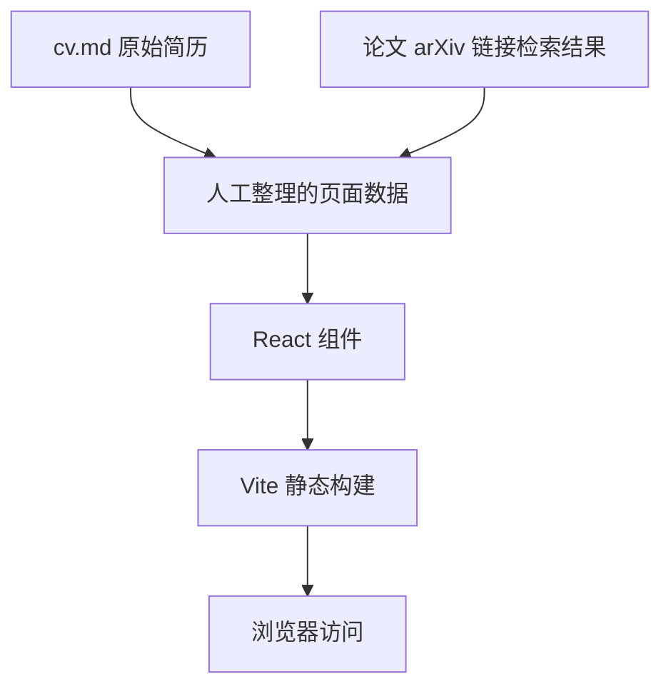

## 1. 架构设计
项目采用纯前端静态站点架构，内容来自本地结构化数据，由 React 渲染为单页个人主页。无需后端和数据库。



## 2. 技术说明
- 前端：React 18 + Vite
- 样式：原生 CSS，使用 CSS variables 管理主题、间距和响应式断点
- 数据：在前端代码中维护 `profileData`、`education`、`experiences`、`publications` 等数组
- 部署：静态文件，可通过本地 `npm run dev` 预览，`npm run build` 生成产物
- 外部服务：无运行时外部服务；论文链接为普通 `<a>` 外链

## 3. 路由定义
| 路由 | 用途 |
|---|---|
| `/` | 单页个人主页，展示全部简历内容 |

## 4. 组件划分
| 组件 | 职责 |
|---|---|
| `App` | 页面整体布局和章节组合 |
| `Hero` | 姓名、联系信息、研究关键词、页面摘要 |
| `Section` | 通用章节外壳，统一标题和锚点 |
| `EducationTimeline` | 教育经历展示 |
| `ExperienceTimeline` | 实习经历时间轴 |
| `PublicationList` | 论文列表、venue 标签、arXiv/公开链接 |
| `NavRail` | 桌面端章节导航 |

## 5. 数据模型

### 5.1 TypeScript 风格数据结构
```ts
type LinkInfo = {
  label: string;
  url?: string;
  status?: "available" | "pending" | "external";
};

type Publication = {
  title: string;
  venue: string;
  role: string;
  summary: string;
  link: LinkInfo;
};

type Experience = {
  organization: string;
  team: string;
  time: string;
  location: string;
  bullets: string[];
};
```

### 5.2 内容来源约束
- 章节顺序必须与 `cv.md` 保持一致：个人信息、教育、实习经历、研究。
- 论文顺序必须与 `cv.md` 的 Research 区保持一致。
- 能确认 arXiv 的论文直接使用 arXiv abstract 页面链接。
- 未能确认 arXiv 的论文不伪造链接，展示“待补充 arXiv”或替代公开 PDF/OpenReview 链接。

## 6. 构建与验证
- 初始化项目文件：`package.json`、`index.html`、`src/main.jsx`、`src/App.jsx`、`src/styles.css`
- 本地验证：运行 `npm install` 后执行 `npm run build`
- 视觉验证：运行 `npm run dev` 后用浏览器检查桌面和移动宽度
- 内容验证：人工核对页面论文数量、顺序和链接状态是否与 PRD 一致
